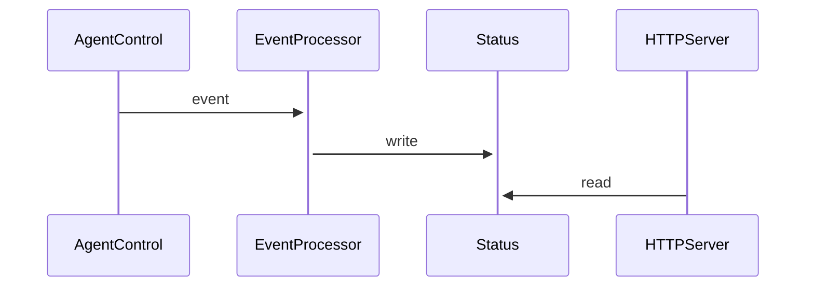
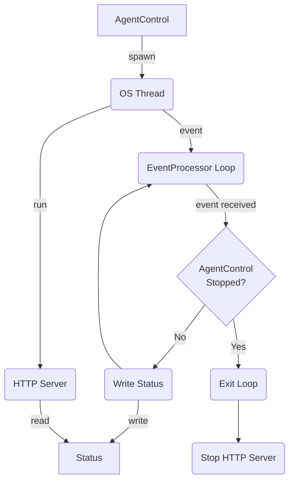

## HTTP Server

### Status endpoint

The status endpoint is meant to expose the current status of the Agent Control and Sub Agents.
Example of the output:

```bash
$ curl localhost:127.0.0.1/status
```

```json
{
  "agent_control": {
    "healthy": true,
    "last_error": "",
    "status": ""
  },
  "fleet": {
    "enabled": true,
    "endpoint": "https://example.com/opamp/v1",
    "reachable": true
  },
  "sub_agents": [
    {
      "agent_id": "infrastructure_agent_id_1",
      "agent_type": "newrelic/com.newrelic.infrastructure:0.0.1",
      "healthy": true,
      "last_error": "",
      "status": ""
    },
    {
      "agent_id": "infrastructure_agent_id_1",
      "agent_type": "newrelic/com.newrelic.infrastructure:0.0.1",
      "healthy": false,
      "last_error": "The sub-agent exceeded the number of retries defined in its restart policy.",
      "status": "[xx/xx/xx xx:xx:xx.xxxx] debug: could not read config at /etc/newrelic-infra.yml"
    }
  ]
}
```

### Configuration

The status endpoint is disabled by default. It has the following
configuration options:

```yaml
# Default values
server:
  host: "127.0.0.1"
  port: 51200
  workers: 1
  enabled: false
```

### Architecture

To be able to get this information we will have a "thread" with a service listening to the Agent Control Events
(`EventProcessor`) and updating a structure (`Status`) with the current status. In another "thread" we will have
an HTTP Server (`HTTPServer`) with access to the status struct, and it will expose this. The `Status` struct
needs to be inside an `Arc<RWLock>` as it needs to be read/written form different threads.



The Server will run in a separate OS Thread and inside it every service is Async. The main flow will stop
when the `EventProcessor` receives a `AgentControlStopped` event. This event will make the `EventProcessor`
stop, and this will trigger the Stop of the HTTP Server. Once is stopped, the OS Thread will exit.



The chosen web server is [Actix](https://actix.rs/) and runs within Tokio so all the components will
run in async.
