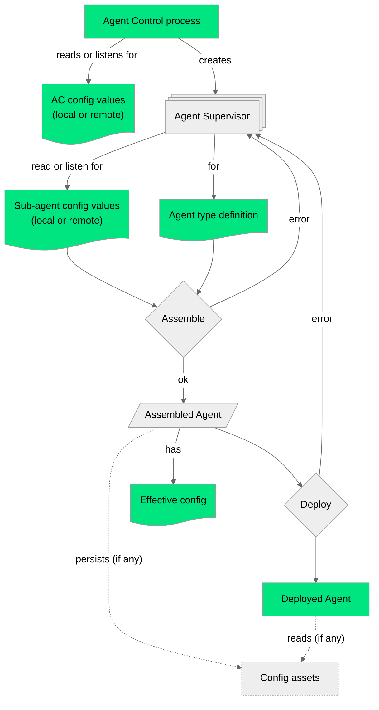
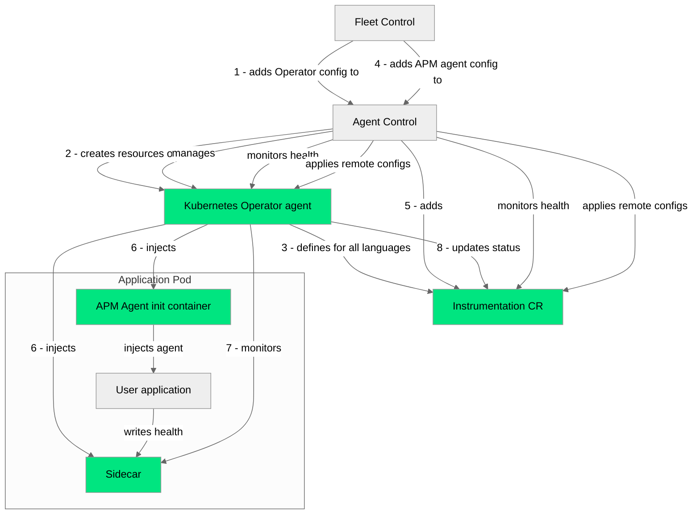

# Integrating with Agent Control

## Defining a sub-agent workload

Currently, the supported workloads that AC is able to manage are hard-coded into the program. However, it is intended that the AC team or external teams can easily add new supported agents to it, so we have exposed a way to specify how to run, configure, manage and check the health of a workload in the form of a YAML file. This file describes what we call an **agent type definition**. In some places of the codebase, we might refer to the workload created for a certain agent type as an **agent type instance**.

The definition for an agent type consists on a single YAML file with three main areas defined below.

We recommend that you read the following sections, but at any time feel free to check the currently available definitions [here](../agent-control/agent-type-registry/README.md) to see working examples of the explained concepts.

### Agent Type Metadata

Contains top-level fields for the name of the agent type, with a namespace, and the version.

The version used here is not the version of your agent, but **the version of the agent type definition**. For example, at the time of writing this we may use `version: 0.1.0` for our Infrastructure Agent definition, but the version of the actual Infrastructure Agent binary that AC ends up running as sub-agent would be the most recent one (`1.60.1`).

Agent Types are versioned to ensure compatibility with a given configuration values (no breaking changes, see below). As of now, we maintain only one version per agent type and use a fixed `0.1.0` value for it because these definitions are not easily visible to FC, but FC needs to know what are the agent types and their versions to make the metadata visible on New Relic's UI. As of now **we prohibit pushing breaking changes for these definitions, and any exceptions to this need to be validated at least by both AC and FC teams**.

This is an example section for the metadata fields, using the actual agent type definition for the New Relic Infrastructure Agent.

```yaml
namespace: newrelic
name: com.newrelic.infrastructure
version: 0.1.0
# ... 
```

### Agent Type Variables

This section, defined under the top-level field `variables`, enables the dynamic configuration of the workload created by AC by exposing arbitrary variables. The variables are grouped into three main sections: `common`, `on_host` and `k8s`. Inside these, the variables can be arbitrarily grouped into common fields forming a tree, where the final leaf will determine the actual variable, its type and its allowed contents.

Defining variables is entirely optional, but if no variables are defined then no dynamic configuration will be possible for this sub-agent, AC will be only capable of adding or removing it as a workload using its deployment instructions and at most the environment variables available to AC at the time it's running (see the [deployment](#agent-type-deployment) section below).

The following is a section of the defined configuration variables for the New Relic Infrastructure Agent. You can read a detailed explanation below.

```yaml
variables:
  on_host:
    config_agent:
      description: "Newrelic infra configuration"
      type: file
      required: false
      default: ""
      file_path: "newrelic-infra.yml"
  k8s:
    chart_values:
      newrelic-infrastructure:
        description: "newrelic-infrastructure chart values"
        type: yaml
        required: false
        default: {}
      nri-metadata-injection:
        description: "nri-metadata-injection chart values"
        type: yaml
        required: false
        default: {}
      global:
        description: "Global chart values"
        type: yaml
        required: false
        default: {}
    chart_version:
      description: "nri-bundle chart version"
      type: string
      required: true
```

See that we don't have a `common` section, for `on_host` we define a single variable called `config_agent`, while inside `k8s` we have a field `chart_values` that defines three variables inside (`newrelic-infrastructure`, `nri-metadata-injection` and `global`) while a remaining variable `chart_version` is outside, as another top-level field for the `k8s` section.

When referencing these variables elsewhere, as you will see in the [deployment](#agent-type-deployment) and [applying configuration](#applying-configurations) sections, you would access these nested fields using a dot (`.`), as usual for accessing fields in programming languages. For our example, we would use `chart_values.newrelic-infrastructure` `chart_values.nri-metadata-injection` `chart_values.global` and `chart_version` respectively.

The variables can theoretically be nested this way indefinitely, but for usability purposes we advise to keep this at a reasonable level.

#### Variable definition

For the *leaf nodes* of the variable definitions, we currently support the following fields:

##### `description` (`String`)

A description of the variable, for documentation purposes.

##### `type` (`String`)

The value type that is accepted for this variable. As of now, the following types are supported (using the allowed values for the field):

- `string`.
- `bool`.
- `number`: Integer or floating point are supported.
- `file`: Intended to contain the same as `string`, which will be the contents of the file. See [Templating `file` and `map[string]file` variables](#templating-file-and-mapstringfile-variables) for an explanation of what this type does[^1].
- `map[string]string`: i.e. key-value pairs.
- `map[string]file`: Intended to contain the same as `map[string]string`, the keys of the map being the file names and their values the file contents. See [Templating `file` and `map[string]file` variables](#templating-file-and-mapstringfile-variables) for an explanation of what this type does[^1].
- `yaml`: An arbitrary YAML value, like an array, an object or even a scalar.

##### `required` (`bool`)

Specifies if providing a value for this variable is required or not. If `required` is `false`, a `default` value of its specified [type](#type-string) needs to be provided.

##### `default` (optional)

A default value for this variable, for the cases where no configuration value has been passed for this variable when creating an instance for the agent type. Its value must be of the same type as the one declared for the variable.

##### `file_path` (`String`, optional)

If the type for the variable is `file` or `map[string]file`, this field defines either the file name (for `file`) or the containing directory name (for `map[string]file`) for the rendered files passed as values.

##### `variants` (optional)

A list of accepted values for this variable, of the same type as the one declared for it. If a configuration includes a value for this variable that is not among the specified variants, the configuration will not be considered valid.

### Agent Type Deployment

This actually defines how the workload will be created and managed by AC, and it's defined under the top-level field `deployment`.

The deployment information can contain instructions for on-host deployment, for Kubernetes deployment or for both, but **cannot be empty**.

#### The role of `variables`

These instructions can be dynamically *rendered* using as inputs the **values** for the [variables](#agent-type-variables) exposed above, environment variables and other internal information exposed by AC. To reference any of these contents we use a template syntax with the form `${<NAMESPACE>:<VARIABLE_REF>}`. The `NAMESPACE` section can have the following values and determines what the `VARIABLE_REF` section represents:

- `nr-var`: a variable exposed as in the previous section. If you defined a variable called `configs.some_toggle` then you can reference it inside the `deployment` section as `${nr-var:configs.some_toggle}`.
- `nr-env`: environment variables. So, if AC started running with an env var called `MY_ENV` defined, it can be used inside the `deployment` section with `${nr-env:MY_ENV}`.
- `nr-sub`: metadata variables related to the current workload populated automatically by AC. As of now, only the variable `agent_id` is exposed, which is a unique, human-friendly identifier of the current workload.
- `nr-ac`: global metadata used by AC. As of now, this is used only for on-host and contains the variable `host_id`, which will contain an identifier calculated from retrieved information about the host such as the hostname or cloud-related data (if available).

When talking about the variables that were defined in the `variables` field for an agent type definition, that can be used as local or received as remote configuration for an agent type instance, we will often use the term configuration values or just **values**.

All of these variable references will be replaced with actual values, either provided with configuration values or their defaults if missing and the variables are not required, on a rendering stage that will create the final instructions for the deployment.

When adding these values as a user, either as a local config for AC (a file in the filesystem for on-host or a ConfigMap for Kubernetes) or as remote configs made available from FC, the format used is a YAML file with the values following the same tree-like structure defined for the variables in the agent type definition, but the *leaf nodes* being the actual values.

For examples of this with actual agent type definitions, see [config examples](https://docs-preview.newrelic.com/docs/new-relic-agent-control-linux#config-examples) in the official New Relic documentation site.

##### Environment variable expansion on configuration values

Any AC environment variable can be referenced within local or remote configuration values using the `${nr-env:<ENVIRONMENT_VARIABLE>}` syntax. During the rendering process, AC will resolve the `ENVIRONMENT_VARIABLE` and replace the placeholder with its corresponding value. 

For example, consider the following configuration snippet:

```yaml
config_agent:
  license_key: ${nr-env:LICENSE_KEY}
```

In this case, AC will look for an environment variable named `LICENSE_KEY` and substitute its value into the configuration.

It is important to note that the availability of environment variables depends on the environment where AC is running:

- **On-host installations**: AC will have access to environment variables configured at the systemd service level. Ensure that any required variables are properly defined in the service configuration.
- **Kubernetes deployments**: AC will have access to environment variables attached to the AC Pod. These variables can be defined in the Pod's manifest, typically under the `env` section.

By leveraging this mechanism, you can dynamically inject environment-specific values into your configurations, simplifying deployment and ensuring flexibility across different environments.

##### Templating `file` and `map[string]file` variables

When a variable of type `file` or `map[string]file` is referenced inside the `deployment` section, the rendering process will:

1. Persist the contents of the variable (the provided configuration value or the default if the variable is not required) on a certain location on the file system.
2. Replace the variable reference with the complete file path.
    - For `file`, the full path to the file.
    - For `map[string]file`, the full path to a directory containing each of the map's key-value pairs as file name and file contents respectively.

The following is a section of the defined deployment instructions for the New Relic Infrastructure Agent. It contains definitions both for on-host and Kubernetes, so this agent type is supported when AC runs on either setting.

```yaml
deployment:
  on_host:
    enable_file_logging: ${nr-var:enable_file_logging}
    health:
      interval: 5s
      timeout: 5s
      http:
        path: "/v1/status/health"
        port: ${nr-var:health_port}
    executable:
      path: /usr/bin/newrelic-infra
      args: >-
        --config=${nr-var:config_agent}
      env:
        NRIA_PLUGIN_DIR: "${nr-var:config_integrations}"
        NR_HOST_ID: "${nr-ac:host_id}"
      restart_policy:
        backoff_strategy:
          type: fixed
          backoff_delay: ${nr-var:backoff_delay}
  k8s:
    health:
      interval: 30s
    objects:
      release:
        apiVersion: helm.toolkit.fluxcd.io/v2
        kind: HelmRelease
        metadata:
          name: ${nr-sub:agent_id}
        spec:
          interval: 3m
          # ... omitted for brevity
          values:
            newrelic-infrastructure: ${nr-var:chart_values.newrelic-infrastructure}
            nri-metadata-injection: ${nr-var:chart_values.nri-metadata-injection}
            kube-state-metrics: ${nr-var:chart_values.kube-state-metrics}
            nri-kube-events: ${nr-var:chart_values.nri-kube-events}
            global: ${nr-var:chart_values.global}
```

#### On-host deployment definition

The following fields are used for configuring the on-host deployment of a sub-agent.

##### `executable`

Instructions to actually run the sub-agent process. It is composed of the following fields:

- `path`: Full path to the executable binary. A string.
- `args`: Command line arguments passed to the executable. This is a string.
- `env`: A key-value mapping of environment variables and their respective values. Strings.
- `restart_policy`: How the sub-agent should behave if it ends execution. If this policy limits are exceeded the sub-agent will be marked as unhealthy (see [Health status](#health-status) below) and not restarted anymore. Accepts the following fields:
  - `restart_exit_codes`: An array of numbers matching the exit codes where the restart policy will be applied. Any exit code not on this list won't trigger a restart. If not provided, the process will be restarted on non-successful codes.
  - `backoff_strategy`: Timing-related configuration for the restart, to prevent wasteful crash-loops. Accepts the following values:
    - `type`: either `fixed`, `linear` or `exponential`.
    - `backoff_delay`: Time between restarts. This is a time string in the form of `10s`, `1h`, etc.
    - `max_retries`: Maximum number of restart tries. A number.
    - `last_retry_interval`: Time interval for the back-off number of retries to maintain its number. That is, if the process spends more than this interval after the restart policy was triggered, the restart policy values like the current tries or the back-off delays will be reset.  This is a time string in the form of `10s`, `1h`, etc.

As of now, the `executable` field is actually **optional**. This was intended to cover the APM agents use case for on-host, in which the agents are not processes but libraries or plugins injected to other processes, customer applications, whose lifecycle AC must not manage (see [*Agent-less* supervisors](#agent-less-supervisors) below). However, this is **not yet supported**. An agent without `executable`s is accepted as valid, but AC will just spawn an internal supervisor structure for the sub-agent without actually doing anything besides checking health, if it was configured.

##### `enable_file_logging` (`bool`)

When set, this redirects the `stdout` and `stderr` of the created process to files inside AC's logging directory (see [on-host troubleshooting](https://docs-preview.newrelic.com/docs/new-relic-agent-control-linux#debug) in the official public documentation). These log files will reside inside a directory dedicated to the current sub-agent, identifiable by its `agent_id`.

##### `health` (on-host)

Enables periodically checking the health of the sub-agent. See [Health status](#health-status) below for more details. Accepts the following values:

- `interval`: Periodicity of the check. A duration string.
- `timeout`: Maximum duration a health check may run before considered failed.
- `http` or `file`: The type of health check used.
  - `http` means that the supervisor for this sub-agent will attempt to query an HTTP endpoint and will decide on healthiness depending on the status code. Accepts the following fields:
    - `host`, string.
    - `path`, string.
    - `port`, a number.
    - `headers`: key-value pairs for authentication or other required info.
    - `healthy_status_codes`: The status codes that mean a healthy state. If not set, as of now the 200s will be considered healthy and the rest unhealthy.
  - `file` means that the supervisor for this sub-agent will attempt to read a file and find expected contents. Failing to do so, or reading information that means an unhealthy state, will mark the sub-agent as unhealthy. Accepts `path` as its only field.

If no health configuration is defined, AC will use the exceeding of the restart policy (if also defined) to determine if the sub-agent should be labelled as unhealthy.

#### Kubernetes deployment definition

The following fields are used for configuring the Kubernetes deployment of a sub-agent.

##### `health` (Kubernetes)

The health configuration for Kubernetes. See [Health status](#health-status) below for more details. Accepts the following values:

- `interval`: Periodicity pf the check. A duration string.

##### `objects`

Key-value pairs of the [Kubernetes Objects](https://kubernetes.io/docs/concepts/overview/working-with-objects/) to be created by this sub-agent on deployment. The key is the name of the object, while the value is the object itself which accepts the following values:

- `apiVersion`, a string.
- `kind`, a string.
- `metadata`: Accepting the following:
  - `name`, a string.
  - `labels`: key-value pair of strings representing Kubernetes labels.
- And a collection of arbitrary fields representing the actual data (e.g. the `spec`) of the object.

[Flux](https://fluxcd.io) is expected to be installed in the cluster to manage Flux resources.

## Applying configurations

Either the first time it runs, using static configs or when already running and receiving remote configuration values from FC, AC will create an internal entity called a *supervisor* for each of the declared sub-agents. Each of these supervisors have the following responsibilities:

1. Retrieve the configuration available for it, either locally or by listening for remote if FC is enabled.
2. Attempt to assemble the actual, effective config that the sub-agent will have.
3. If the assembly is successful, attempt to deploy (spawn process or create Kubernetes resources) the sub-agent using the effective config.
4. Once the sub-agent is deployed:
    - Perform regular health checks.
    - Restart it if it crashes, according to the configured restart policy (for on-host).
    - Assure that the resources match the ones defined in the agent-type (for k8s).
5. If Fleet Control is enabled, the supervisor will listen for incoming remote configs different from the one currently in use:
    - When receiving one, the supervisor will stop its workload and restart from step 1 again.
    - If an empty config is passed it means that this agent should be retired, so the supervisor will just stop its workload and exit.
6. On failure of assembly or deployment, the supervisor will be kept alive, but will report itself as unhealthy. If FC is enabled, this offers the user the possibility of pushing a new remote config, in case the sub-agent was left in a bad state due to receiving an invalid one.

Agent Control itself shares much of the behavior of a supervisor, that's how, if FC is enabled, it can receive remote configs (mainly the desired list of sub-agents) and apply them.

### A note on the *effective config*

When we mention a sub-agent's effective config, we actually mean [a concept from the OpAMP protocol](https://github.com/open-telemetry/opamp-spec/blob/main/specification.md#effectiveconfig-message). It consists on the configuration values that can be received remotely from an OpAMP server, so it does not necessarily (and often just won't) match the configuration of the workload itself. The configuration values are expected to couple with the agent type definition to render the final instructions on how to render agents. You can assume that the effective config is more for the *supervisor* than for the sub-agent itself.

Of course, these values might still contain your observability agent's own config among the rest of the values, but it should not be assumed that these values fully determine and represent the actual state of your agent's config at all times. For example, if your agent is designed in a way that can accept remote configs through other means (like over the network) that take precedence over the config it first runs with or the configs present in files it watches (as these could be rendered by the supervisor), integrating your agent with AC does not make it aware of these other configuration means, so a mismatch of what we call the *effective config* vs the *actual config of your agent* is to be expected.

The following flowchart illustrates the config application of a sub-agent via its supervisor, though it omits the health checks and its explicit reporting (along the effective config) to FC.



## Health status

The health status that AC reports to FC follows the [definition of component health used by the OpAMP protocol](https://github.com/open-telemetry/opamp-spec/blob/main/specification.md#componenthealth-message). Essentially, for each sub-agent we will send the following information:

- If it is healthy or not.
- The time the sub-agent was started (as UNIX time in nanoseconds).
- The time of the last health check (as UNIX time in nanoseconds).
- A **status** message using agent-specific semantics.
- If the sub-agent is unhealthy, a human-readable error message commonly called **last error**.
- Optionally, we are capable of sending this same information for arbitrary levels of subcomponents, representing a composite, more granular health. As of now, this information won't be used by FC.

However, we don't offer the same degree of support for agent type authors to populate this information, and in some cases we provide this information internally from AC. Where complete support is offered, the author of the agent type is ultimately responsible for the contents of the health messages built (for example, ensuring the status message uses agent-specific semantics or the error message is human-friendly).

### Health for On-host

#### HTTP

Currently, HTTP support for on-host health checks is kept simple. With the host, path and port provided in the agent type definition, AC will compose a URL and the supervisor for any of these sub-agents will periodically perform an HTTP `GET` request to it. The response body of this request converted to UTF-8 will be used as the health status message.

If the status code is in the 200's (successful) or one of the configured in the list of allowed status codes the sub-agent will be reported as healthy. If the request times out or the status code is not one defined as healthy, AC will report the sub-agent as unhealthy, using `"Health check failed with HTTP response status code <CODE>"` as the last error string.

#### File

With file-based health checks, a YAML file is expected to be present at the location configured, with the following format:

```yaml
healthy: false
status: "some agent-specific message"
last_error: "some error message" # optional, for the case healthy == false
start_time_unix_nano: 1725444000
status_time_unix_nano: 1725444001
```

AC will periodically attempt to read this file and forward its contents as a health message. If `health` is `true`, but there are contents for `last_error`, the latter will be ignored and the check will be considered healthy.

The workload is responsible for keeping this file updated over time, as AC will not check that property. It will only parse and propagate the values as the health message.

The file-based health check is implemented for the New Relic APM agents, and is leveraged internally when running on Kubernetes. See [Instrumentation CR](#instrumentation-cr) and [APM](#apm) for details.

### Health on Kubernetess

The approaches followed by on-host are not trivial to implement for Kubernetes, and Kubernetes already provides built-in mechanisms to inspect the health of its resources, so AC leverages these built-ins.

The health check will perform several operations depending on whether the Kubernetes resources created by the agent type instance are Helm releases or [Custom Resources (CR)](https://kubernetes.io/docs/concepts/extend-kubernetes/api-extension/custom-resources/) defined by New Relic called Instrumentations. It is also possible to have these two kinds of resources created, in that case the health checks will perform the operations for both.

The nature of all these checks is all in all very similar. It involves mostly querying the Kubernetes API server for a certain resource, looking up specific fields of its object representation (like its `status` or its `metadata`), and performing an evaluation of the values contained within them. The only difference is that the structure of the Instrumentation objects is defined by New Relic, while the remaining ones are defined by Kubernetes itself or by well-known tooling of the Kubernetes ecosystem such as Helm.

For agents that do not define Helm releases, how they work, and the Instrumentation CRD, see [*Agent-less* supervisors](#agent-less-supervisors) below.

#### Helm releases

If the agent type's deployment section for Kubernetes defined Helm releases, the health check will query different information sources and evaluate their contents with resource-specific logic. If any of these evaluations determine as unhealthy, the sub-agent will be considered unhealthy.

The sources inspected are listed below:

##### Helm Release

AC will attempt to retrieve the `status` field of the Helm release object. Inside this `status` it will retrieve a list of conditions and check if the `ready` condition exists and is true, which means healthy. If it's false, it will consider this check unhealthy and emit a message as last error.

##### StatefulSets

For [StatefulSets](https://kubernetes.io/docs/concepts/workloads/controllers/statefulset/), AC will set healthy whenever the number of replicas matches the number of ready replicas.

##### DaemonSets

With [DaemonSets](https://kubernetes.io/docs/concepts/workloads/controllers/daemonset/), the health check will evaluate if the number of pods is the desired one, if no pods are unavailable, and in the case the DaemonSet upses the rolling update strategy, if all pods are running the latest version.

##### Deployment

For [Deployments](https://kubernetes.io/docs/concepts/workloads/controllers/deployment/), AC will set healthy whenever there is no unavailable replicas.

#### Instrumentation CR

The Instrumentation is a custom resource defined by New Relic to represent the status of agents inside Kubernetes, mostly to enable the use case of supervising [*Agent-less* workloads](#agent-less-supervisors). Much of the information specified here will contain details specific to them and how they work on Kubernetes, mentioning components such as the Kubernetes Operator or the Sidecar. Retrieving the health information of Instrumentations is a completely custom procedure that is not strictly related to Kubernetes beyond the retrieval of the resource itself.

As of now, the health check for Instrumentations involves reading their `status` value, which should contain the following fields:

- `podsMatching` is the number of pods which match the `Instrumentation.spec.podLabelSelectors` and `Instrumentation.spec.NamespaceLabelSelectors`.
- `podsHealthy` is the number of pods which match based on `podsMatching` and `podsInjected` (see below) and the operator (see below) was able to get:
  - The correct pod IP/port.
  - A health response which had a healthy status reported via the YAML field `healthy`.
  - An HTTP status code of `200`.
- `podsInjected` is the number of pods which matched the Instrumentation based on `podsMatching` which had the health sidecar injected.
- `podsNotReady` is the number of pods which are not in a ready state (`Pod.status.phase` != `"Running"`) `podsMatching` and `podsInjected`.
- `podsOutdated` is the number of pods which match based on `podsMatching` and `podsInjected`, but where there's a mismatch between the `Instrumentation.generation` and the injected pod's annotation (to identify changes to the spec).
- `podsUnhealthy` is the number of pods which failed a health check, either because the operator couldn't get the pod's IP or port, communication issues, timeout, non-200 HTTP status, failure to decode the HTTP response, and lastly the `last_error` field in the response.
- `unhealthyPodsErrors` is a list of pods (`namespace.name/pod.name`) and either the last error from the response or the error from the operator while trying to collect health.
  - `pod` is the name of the pod.
  - `last_error` is the error string.

As of now, the logic determining if a sub-agent is the following:

- `podsNotReady` must be 0.
- `podsUnhealthy` must be 0.
- `podsHealthy` must be more than 0.
- `podsMatching` must be more than 0.
- `podsInjected` must be equal to `podsMatching`.

If unhealthy, the `last_error` field will be populated with the Instrumentation status' `unhealthyPodsErrors` field.

## *Agent-less* supervisors

If we hadn't mentioned the possibility of *agent-less* supervisors before, you might have asked yourself if all the agents that AC can support are limited to ones where an actual, stand-alone *process* (either traditional one on a server or Kubernetes-based such as a pod) is running. After all, the main example of supported agent type is the Infrastructure Agent, a separate binary that is intended to run alongside the customer business workload, but separate from them.

It turns out that there are other use cases for which New Relic Control might be useful where a process either does not exist or must not be managed by AC. [APM](https://docs.newrelic.com/docs/apm/new-relic-apm/getting-started/introduction-apm/) is one of them.

### APM

With APM, a customer instruments some existing application by plugging in a shared object, library, or some other plug-in component to the programming language runtime. For example, you could add some Java-specific command line options pointing to the New Relic Java agent's JAR file when running your Java application, so the agent is hooked into the JVM. In this case, the only process is the actual customer application, whose lifecycle must not be managed by AC as opposed to a separate observability agent.

This is why AC supports defining agent types that do not include any actual stand-alone process but otherwise have observability agent functionality, can receive remote configs and expose health information. As of now, this is mostly supported in Kubernetes only, with on-host planned for the future.

#### APM supervisors on Kubernetes

The APM use case for Kubernetes is supported by using some additional components that run in the cluster alongside AC. The main one is [Kubernetes APM auto-attach](https://docs.newrelic.com/docs/kubernetes-pixie/kubernetes-integration/installation/k8s-agent-operator/) (also known as *Kubernetes agents operator* or just the Kubernetes operator), which is defined as an agent type for AC.

Normally, the Kubernetes operator will intercept API requests for deploying pods onto nodes and, depending on the configuration specified, adds the appropriate language agent to the application via an [init container](https://kubernetes.io/docs/concepts/workloads/pods/init-containers/). This is achieved by the operator creating the Instrumentation Custom Resource Definition (CRD), so it is later possible to [create Instrumentation resources](https://docs.newrelic.com/docs/kubernetes-pixie/kubernetes-integration/installation/k8s-agent-operator/#configure-auto-instrumentation) configured to match application pods via pod label selectors. After these Instrumentation resources are created, the operator will inject the init container for the new pods matching these labels.

When used alongside AC, the operator will also inject a sidecar container alongside each application pod. This sidecar has the role of retrieving the health status using a similar method to the file-based health check approach for on-host:

1. The language agents inside the application pods will write the health file (or files) into the file system.
2. The sidecar will read these files and expose their contents as an HTTP endpoint. If it reads many files, it will coalesce their information into a single health output.
3. The Kubernetes operator will fetch the health information from the sidecars and will update the Instrumentation CR's status with the value of this health.
4. The health inside the Instrumentation CR is read periodically by AC, as exposed above when discussing health in Kubernetes on [Instrumentation CR](#instrumentation-cr), and then reported to FC.

So, to support APM use cases with AC, we can define an agent type that specifies an Instrumentation CRs appropriate for the language. Ensuring that this agent type instance is deployed alongside a single instance for the Kubernetes operator (also an agent type deployable with AC), the auto-instrumentation of applications and the health reporting will work.

As the Instrumentation CR also enables [configuring the APM agents](https://docs.newrelic.com/docs/kubernetes-pixie/kubernetes-integration/installation/k8s-agent-operator/#apm-config-parameters), pushing remote configurations from FC is also possible.

You can check our agent type definitions for the currently supported APM languages in our hardcoded [registry](../agent-control/agent-type-registry/README.md).

The following diagram reflects the flow of an APM agent being added as a remote config to a Kubernetes cluster where the Kubernetes operator is already deployed. Some of the arrows connecting entities are numbered to represent the timing.


