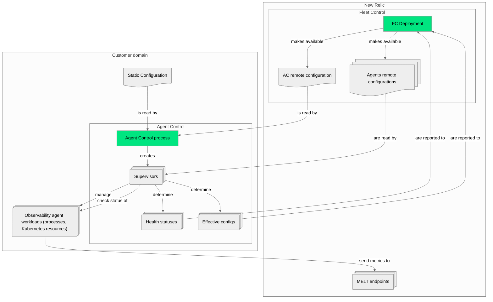

# Agent Control documentation

Welcome to the Agent Control codebase! This is intended to be an entry point for the high-level documentation of this project.

If you are a new team member for Agent Control or even New Relic as a whole, or from another team wanting to integrate your product or agent with New Relic Control, keep reading! If you are acquainted with Agent Control already and want to push changes to the codebase, please read [`CONTRIBUTING.md`](../CONTRIBUTING.md).

## General overview

### What is Agent Control?

Agent Control (AC) is a tool intended to be installed in customer's hardware, be it used as a traditional server (physical or virtual machines, cloud computing resources such as AWS EC2, what we usually call *on-host*) or a Kubernetes cluster. From there, it orchestrates the lifecycle of instrumentation agents supported by New Relic for that kind of hardware, like the [infrastructure agent](https://docs.newrelic.com/docs/infrastructure/introduction-infra-monitoring/), the [OpenTelemetry Collector](https://docs.newrelic.com/docs/opentelemetry/get-started/collector-infra-monitoring/opentelemetry-collector-infra-intro/), [APM agents](https://docs.newrelic.com/docs/apm/new-relic-apm/getting-started/introduction-apm/) or [Kubernetes-specific integrations](https://docs.newrelic.com/docs/kubernetes-pixie/kubernetes-integration/get-started/introduction-kubernetes-integration/).

Where each agent could be installed using their own means and managed separately before, AC now enables a **control plane** for the customer, exposing a unified interface for managing all of these observability agents at scale. This control plane can be managed remotely from the New Relic platform via Fleet Control (FC). The set of instrumentation agents managed by AC on a certain server or Kubernetes cluster is called a **fleet**.

The controlled observability agents will still send their **Metrics, Events, Logs and Traces (MELT)** on their own terms, as expected of them.

#### Agent Control Capabilities

##### Creates observability workloads

Receiving instructions from either static configuration or from FC, AC will create **workloads** for the specified observability agents of the fleet covering the customer's observability needs. On traditional servers, these workloads will usually be simply **processes and configurations** for the installed agents. On Kubernetes, these will be the appropriate and equivalent **Kubernetes resources**, usually in the form of a [Helm release](https://helm.sh/docs/glossary/#release).

##### Manages the workload configurations

The configuration of these agents, and even the agents themselves that compose the fleet, can be modified by interacting with FC. AC will receive the remote configuration from FC and apply the needed changes on the fleet.

##### Probes and reports the workloads' status

Besides creating, modifying and deleting these workloads, AC is also capable of checking their health and their current configuration (as AC sub-agents, see [Applying configurations in the "Integrating with Agent Control" section](./INTEGRATING_AGENTS.md#applying-configurations)). It will periodically collect and send this information back to FC, so customers can have a quick glance at the general status of their observability fleet deployment. This health information can also be checked locally by interacting with the AC process via an HTTP endpoint (by default at `localhost:51200/status`).

##### Communicates with Fleet Control using open standards

The communication between AC and FC is done over HTTPS and is generally compliant with the [Open Agent Management Protocol (OpAMP)](https://github.com/open-telemetry/opamp-spec), which is, on their own words:

> [...] a network protocol for remote management of large fleets of data collection Agents.

From the point of view of OpAMP, AC is also an agent. That's why, even though each workload will have its own OpAMP communication channel when managed by AC, we commonly refer to the various observability workloads that AC can manage as **sub-agents**.

> [!IMPORTANT]
> Our reliance on OpAMP is especially important, since its specification informs much of the current and planned capabilities of Agent Control (like package downloading, see below) and its relationship with Fleet Control. After the installation process, OpAMP over HTTPS is the **only** means of network communication used by the AC process as of now.

##### Downloads and updates observability agents (on Kubernetes)

Given the nature of Kubernetes resources, Agent Control is capable of downloading arbitrary versions of the observability agents it is managing. For *on-host*, arbitrary agent downloads and upgrades is not yet supported and AC will only manage the agents already present on the system, be it because they were declared dependencies on the package manager used to install AC (so were installed alongside it), or because they were available before.

#### Basic architecture

The following diagram captures the essentials of what is explained above.

The avid reader might be asking at this point "*How does AC know the way to create the resources for a particular agent?*", or perhaps the more interesting "*How can I teach AC to deploy my agent?*" To find answers for these pressing questions, head to the document for [Integrating with Agent Control](./INTEGRATING_AGENTS.md).

## Getting started

For the standard installation of Agent Control, either on-host or Kubernetes, head to the [official documentation](https://docs-preview.newrelic.com/docs/new-relic-agent-control#quickstart) on New Relic's website.

> [!CAUTION]
> The link to documentation shared above currently leads to the **preview** version! This will be stabilized and moved to the main site shortly, so make sure this is updated. Remove this warning when the documentation links to the proper place.

### Developing Agent Control

For setting up a development version of AC, go to [`DEVELOPMENT.md`](./DEVELOPMENT.md).

### Integrating with Agent Control

As mentioned above, if you are interested in making AC capable of managing your own agents, please go to [Integrating with Agent Control](./INTEGRATING_AGENTS.md). Take into account that, as of now, a separate effort must be done for FC. That ensures your agent can be properly represented in New Relic's web UI and remote configs can be exposed for AC to retrieve.
