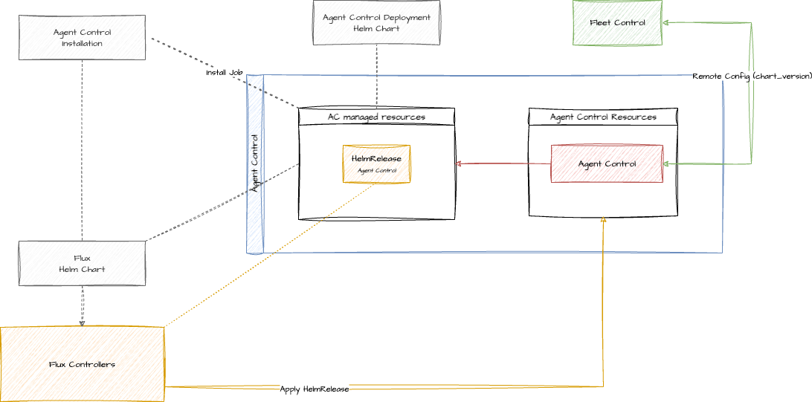
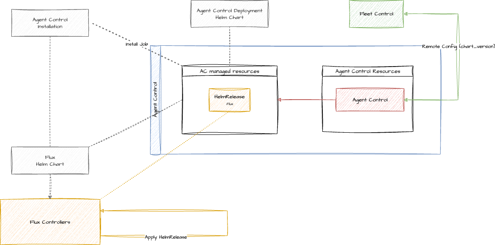

# Remote update

Remote update is a capability of Agent Control that enable updating its version remotely, using Fleet Control. That includes Flux in Kubernetes. However, this feature is not available in all the supported systems yet.

## Supported systems

| System     | Supported |
|------------|-----------|
| OnHost     | ❌        |
| Kubernetes | ✅        |

### Kubernetes

In Kubernetes, both the Agent Control version and Flux version can be updated remotely. We provide a [Helm Chart to install Agent Control](https://github.com/newrelic/helm-charts/tree/master/charts/agent-control), which installs the latest version of Agent Control and Flux 2.15.0. There are some caveats.

#### Caveats

##### Updating Agent Control version

We could receive a remote configuration with an older Agent Control version which doesn't support this feature. In that situation, the Agent Control would end up in a "non-recoverable" state. Updating it would require access to the system. Ideally, the backend should prevent that.

Another risk updating the Agent Control version is that the new version might not support an Agent Type. Be it because it's not yet supported or because it's out of support.

##### Updating Flux version

Flux it's a project of the [CNCF](https://www.cncf.io/) with their own roadmap. Thus, we have to be aware of breaking changes introduced in [flux2](https://github.com/fluxcd/flux2), and potential compatibility issues with the Kubernetes version that we are using. That information is usually in the changelog. For example, [v2.6.0](https://github.com/fluxcd/flux2/releases/tag/v2.6.0). **Migrations** are not automated.

We could receive a remote config that installs Flux and breaks Agent Control because some breaking changes where introduced to the [Custom Resource Definition](https://kubernetes.io/docs/concepts/extend-kubernetes/api-extension/custom-resources/#customresourcedefinitions).

We have some control over that issue. The flux dependency is wrapped in a chart called `agent-control-cd` that we internally use. The client doesn't interact with it directly. The version of this chart is what we allow updating. Hence, the user should never encounter this issue, unless they use their own flux.

## How it works

### Kubernetes

#### High Level Overview

This is the happy path:

1. Fleet Control sends a new remote config with the updated version through OpAMP
2. Agent Control receives and validates the configuration
3. Agent Control applies the update on the system

The implementation is, of course, more complex.

#### Implementation details

Let's start with the Agent Control update.

1. **Receive Configuration**: The process begins when a new remote config is received in the `process_events` function, which then passes it to `handle_remote_config` for processing.
2. **Report Initial State**: To provide visibility, Agent Control reports its status as `Applying`.
3. **Validate and Apply**: The new configuration is validated and stored by the `validate_apply_store_remote_config` function. On success, this function updates Agent Control's own `HelmRelease` with the new version.
4. **Report Final State**: Once the configuration has been successfully applied to the HelmRelease object, Agent Control reports its status as `Applied`.
5. **Reconcile in Cluster**: Flux’s Helm Controller detects the change to the `HelmRelease` and begins a rolling update of the Agent Control pods to finalize the process.

If there's any error, Agent Control will send `Failed` status.

The rolling update is an [strategy](https://kubernetes.io/docs/concepts/workloads/controllers/deployment/#strategy) implemented by kubernetes that incrementally replaces old pods with new ones. It's done in such a way, that old pods will be kept alive if new ones can't be started. Kubernetes assures it with [Liveness and Startup probes](https://kubernetes.io/docs/concepts/configuration/liveness-readiness-startup-probes/).

Flux update works the same way. The only difference is that the `HelmRelease` will be reconciled into itself.

