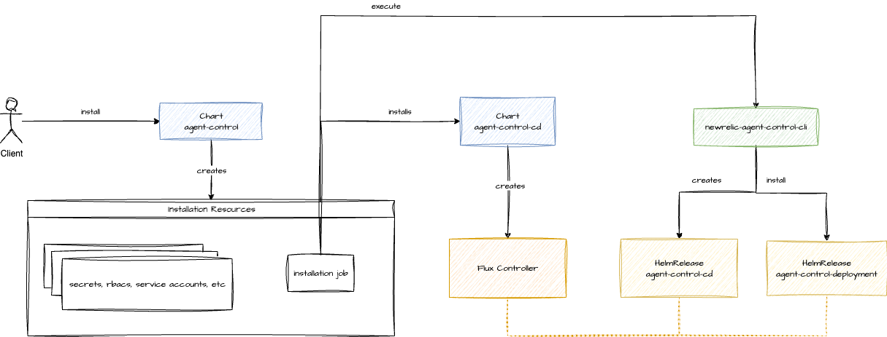

# Remote update

Remote update is a capability of Agent Control that enable updating its version remotely, using Fleet Control. That includes Flux in Kubernetes. However, this feature is not available in all the supported systems yet.

## Supported systems

| System     | Supported |
|------------|-----------|
| OnHost     | ❌        |
| Kubernetes | ✅        |

### Kubernetes

In Kubernetes, both the Agent Control version and Flux version can be updated remotely. We provide a [Helm Chart to install Agent Control](https://github.com/newrelic/helm-charts/tree/master/charts/agent-control), which installs the latest version of Agent Control and Flux 2.15.0. There are some caveats.

#### Caveats

##### Updating Agent Control version

We could receive a remote configuration with an older Agent Control version which doesn't support this feature. In that situation, the Agent Control would end up in a "non-recoverable" state. Updating it would require access to the system. Ideally, the backend should prevent that.

Another risk updating the Agent Control version is that the new version might not support an Agent Type. Be it because it's not yet supported or because it's out of support.

##### Updating Flux version

Flux it's a project of the [CNCF](https://www.cncf.io/) with their own roadmap. Thus, we have to be aware of breaking changes introduced in [flux2](https://github.com/fluxcd/flux2), and potential compatibility issues with the Kubernetes version that we are using. That information is usually in the changelog. For example, [v2.6.0](https://github.com/fluxcd/flux2/releases/tag/v2.6.0).

Flux is wrapped in the `agent-control-cd` chart, which is used internally. The client doesn't interact with it directly. The version of this chart is what we allow updating, instead of the Flux version. Hence, we control the versions of flux that can be installed. For now, we don't support flux version with breaking changes. **Migrations** are not automated.

## How it works

### Kubernetes

#### Installation

For Kubernetes, we provide Helm Charts to simplify the installation process. There are three charts:

* `agent-control` - Starts the installation of Agent Control and all the necessary tools.
* `agent-control-deployment` - This chart is designed to be installed as part of `agent-control` chart, and it installs Agent Control.
* `agent-control-cd` - This chart is designed to be installed as part of `agent-control` chart, and it installs Flux.

Why do we need three charts?

`agent-control` is there to orchestrate the installation and uninstallation, while the other two charts allow Agent Control handling the remote update of each component.
`agent-control-deployment` and `agent-control-cd` charts represent the Agent Control and Flux resources respectively, each chart will be managed by a [HelmRelease](https://fluxcd.io/flux/components/helm/helmreleases/) which represents the desired state of such resources in the cluster.
That's the reason for having three charts.

The following image shows the installation process.



1. The client initiates installation by deploying the `agent-control` chart with Helm
2. The `agent-control` chart creates Kubernetes resources necessary for the installation job and and launches it
3. This installation job deploys `agent-control-cd` (which installs Flux through `helm upgrade --install`) and executes a CLI tool
4. The CLI tool creates the CRs representing the `agent-control-cd` release (which takes ownership of the existing installation) and installs the `agent-control-deployment` by creating the corresponding CRs
5. Finally, `agent-control-deployment` establishes the required resources (rbacs, secrets, config maps, a job to register a system identity, ...) for the pod that will launch the Agent Control binary

#### Uninstallation

The uninstallation process is a bit different.


1. The client initiates the uninstallation of `agent-control` chart
2. The `agent-control` chart creates the uninstallation job
3. The uninstallation job executes a CLI
4. The CLI then uninstalls both the `agent-control-cd` and `agent-control-deployment` making sure that all resources are deleted
   4.1. Deletes Agent Control CRs
   4.2. Deletes objects owned by Agent Control
   4.3. Suspends the `agent-control-cd` `HelmRelease`
   4.4. Deletes the Flux CRs
5. The `agent-control-cd` is uninstalled through `helm uninstall`

#### Agent Control

This is the happy path:

1. Fleet Control sends a new remote config with the updated version through OpAMP
2. Agent Control receives and validates the configuration
3. Agent Control applies the update on the system

The implementation is, of course, more complex.


1. **Receive Configuration**: The process begins when a new remote config is received in the `process_events` function, which then passes it to `handle_remote_config` for processing.

    Example:

    ```yaml
    agents:
        nr-infra: newrelic/com.newrelic.infrastructure:0.1.0
    chart_version: "1.0.0"
    cd_chart_version: "1.0.0"
    ```

2. **Report Initial State**: To provide visibility, Agent Control reports its status as `Applying`.
3. **Validate and Apply**: The new configuration is validated and stored by the `validate_apply_store_remote_config` function. On success, this function updates Agent Control's own `HelmRelease` with the new version and/or the Flux `HelmRelease`.
4. **Report Final State**: Once the configuration has been successfully applied to the HelmRelease object, Agent Control reports its status as `Applied`.
5. **Reconcile in Cluster**: Flux’s Helm Controller detects the change to the `HelmRelease` and begins a rolling update of the Agent Control pods to finalize the process.

If there's any error, Agent Control will send `Failed` status. If everything went well, codewise, but Flux cannot reconcile the different `HelmRelease`. Then, Agent Control will send the `Applied` status and the `HealthChecker` will report `Unhealthy`. You can think of this in the following way. Agent Control did the job and started the process to apply the configuration. There was no problem there. However, Flux cannot turn the config into reality. Agent Control will detect the error and return `Unhealthy` from `spawn_health_checker`.


The rolling update is an [strategy](https://kubernetes.io/docs/concepts/workloads/controllers/deployment/#strategy) implemented by kubernetes that incrementally replaces old pods with new ones. It's done in such a way, that old pods will be kept alive if new ones can't be started. Kubernetes assures it with [Liveness and Startup probes](https://kubernetes.io/docs/concepts/configuration/liveness-readiness-startup-probes/).


