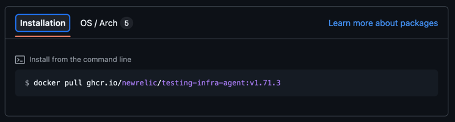
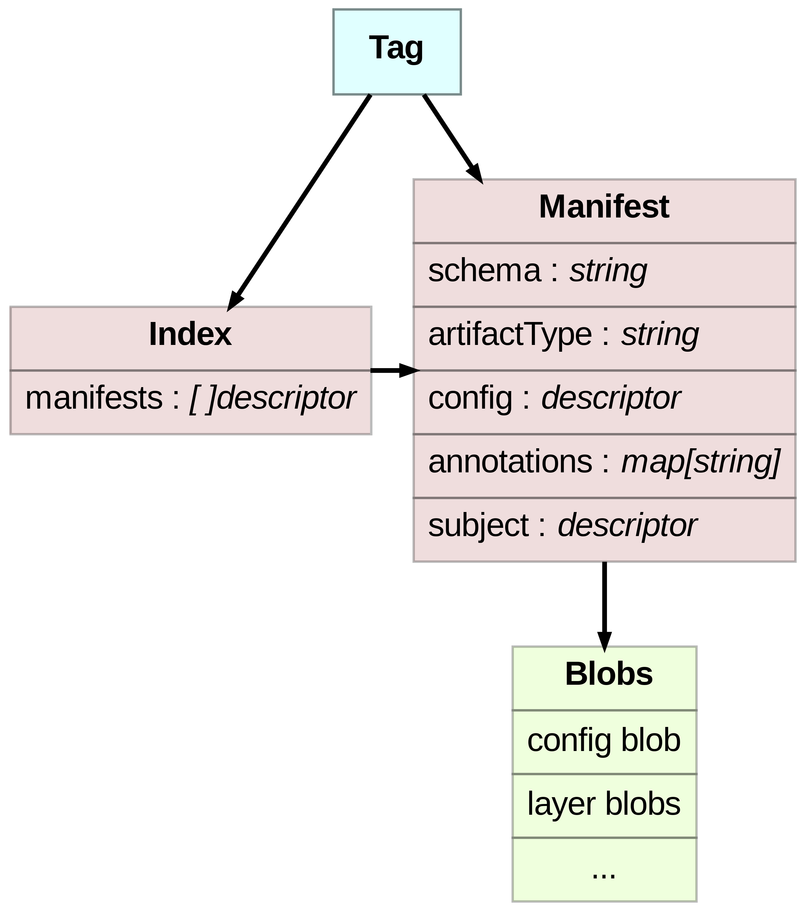

# OCI package registry
We are having a single tag per version pointing to an index that will point to each os/arch manifest identified by its digest.




# OCI Index manifest
The index manifest has an index for each of the artifacts by with its architecture and os so then a specific artifact can be pulled with oras.
Example oras call:
```shell
oras pull ghcr.io/newrelic/testing-infra-agent:v1.71.3 --platform linux/amd64
```

Example of the index manifest:
```json
 {
  "schemaVersion": 2,
  "mediaType": "application/vnd.oci.image.index.v1+json",
  "manifests": [
    {
      "mediaType": "application/vnd.oci.image.manifest.v1+json",
      "digest": "sha256:9b34549b8f5002df0518b002c8ba0ddcb2e004dee988620642fe71ac8d05c780",
      "size": 696,
      "platform": {
        "architecture": "amd64",
        "os": "darwin"
      },
      "artifactType": "application/vnd.newrelic.agent.v1+tar"
    },
    {
      "mediaType": "application/vnd.oci.image.manifest.v1+json",
      "digest": "sha256:4334549b8f5002df0518b002c8dc1ddcb2e004dee988620642fe71ac8d05c711",
      "size": 622,
      "platform": {
        "architecture": "amd64",
        "os": "linux"
      },
      "artifactType": "application/vnd.newrelic.agent.v1+tar"
    }
  ]    
 }
```

# OCI package manifest format
`mediaType`: indicates if it's a manifest or an index.

`artifactType`: is used to determine the type of the artifact. defined as:

- `application/vnd.newrelic.agent.v1+tar`
- `application/vnd.newrelic.agent.v1+zip`

`config`: stores an artifactType `application/vnd.oci.image.config.v1+json` with a digest to a blob containing the os and arch of the current artifact since we have a multiplatform architecture and oras needs this data to create the index.

`layers`: we have decided creating a single layer architecture.

- `mediaType`: same as the artifactType in the root.
- `digest`: pointing to the blob
- `annotations`:
  - `org.opencontainers.image.title`: will be the name of the file, it's added by oras client by default.
  - `org.opencontainers.image.version`: version of the binary for information purposes.
  - `com.newrelic.artifact.type`: if it's a binary (or set of binaries) of an agent_type
  - `org.opencontainers.image.created`: added by default by oras client in the root.

Example:

```json
{
  "schemaVersion": 2,
  "mediaType": "application/vnd.oci.image.manifest.v1+json",
  "artifactType": "application/vnd.newrelic.agent.v1+tar",
  "config": {
    "mediaType": "application/vnd.oci.empty.v1+json",
    "digest": "sha256:44136fa355b3678a1146ad16f7e8649e94fb4fc21fe77e8310c060f61caaff8a",
    "size": 2
  },
  "layers": [
    {
      "mediaType": "application/vnd.newrelic.agent.v1+tar",
      "digest": "sha256:d2a84f4b8b650937ec8f73cd8be2c74add5a911ba64df27458ed8229da804a26",
      "size": 12,
      "annotations": {
        "org.opencontainers.image.title": "agent-control",
        "org.opencontainers.image.version": "2.4.1-rc1",
        "com.newrelic.artifact.type": "binary"
      }
    }
  ],
  "annotations": {
    "org.opencontainers.image.created": "2023-08-03T00:21:51Z"
  }
}

```
