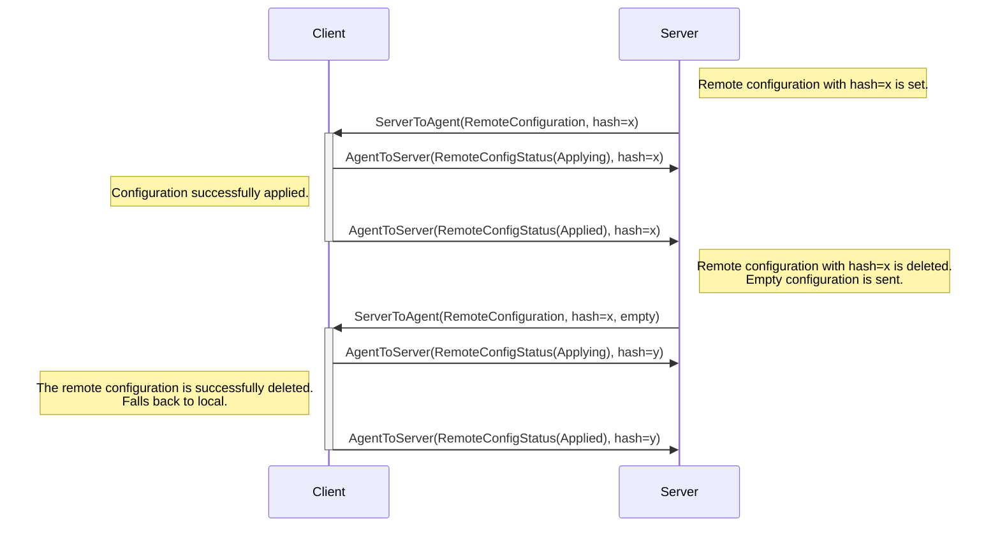

# Delete remote configuration

 Since there is no specific field to delete
a remote configuration in the [ServerToAgent message](https://github.com/open-telemetry/opamp-spec/blob/db1e1fcf14e834469f822496f2fa1ed0512141be/specification.md#servertoagent-message), we use an empty config to do so. In other words, In order to remove a remote configuration and make an agent going back to local or default, the `AgentToServer` from OpAMP will contain an **empty** remote configuration.

Therefore, applying an empty configuration means that agent falls back to the local configuration, and it is important to highlight that this configuration is applied like any other. When the empty configuration is successfully received by the agent, it sends an _Applying_ message, and once it is successfully applied (the agent is running with the local/default configuration), it sends an _Applied_ message. The sequence diagram below shows an scenario where a remote configuration is set and then deleted.



## ❌ RemoteConfigStatus 'UNSET' value

The `UNSET` value for the  `RemoteConfigStatus` field can be a bit misleading, its name might suggest that the value is supposed to be sent when the remote configuration is deleted or removed, but according to the [specification](https://github.com/open-telemetry/opamp-spec/blob/db1e1fcf14e834469f822496f2fa1ed0512141be/specification.md#agenttoserverremote_config_status):

> The list of the Agent packages, including package statuses. This field SHOULD be unset if this information is unchanged since the last AgentToServer message.

Besides, in the [RemoteConfigStatus message definition](https://github.com/open-telemetry/opamp-spec/blob/db1e1fcf14e834469f822496f2fa1ed0512141be/specification.md#remoteconfigstatus-message), it says:

```protobuf
message RemoteConfigStatus {
    bytes last_remote_config_hash = 1;
    enum Status {
        // The value of status field is not set.
        UNSET = 0;

        // Remote config was successfully applied by the Agent.
        APPLIED = 1;

        // Agent is currently applying the remote config that it received earlier.
        APPLYING = 2;

        // Agent tried to apply the config received earlier, but it failed.
        // See error_message for more details.
        FAILED = 3;
    }
    Status status = 2;
    string error_message = 3;
}
```

Considering its definition and the fact of there is no specific field/value to delete/unset a remote configuration in the protocol, the `UNSET` is a default value (zero value) which means that the value of the status field in the message is not set (RemoteConfigStatus is not being reported).
