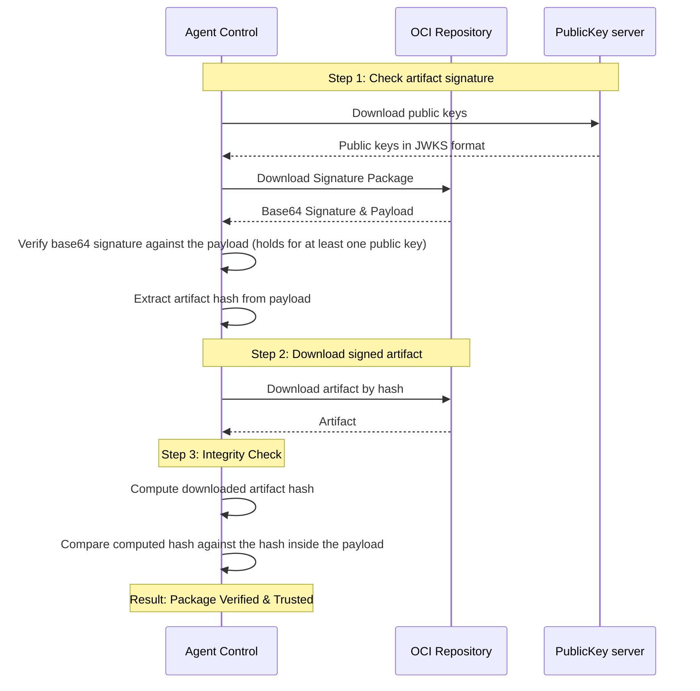

# Package Manager

Agent Control (AC) manages agent packages (and in the future agent types) distributed as OCI ([Open Container Initiative](https://opencontainers.org/)) artifacts.
The package manager handles download, signature verification, extraction, installation and garbage collection of packages from OCI registries.

## Package structure (in the OCI repository)

The packaged agent must comply with the [OCI image spec](https://github.com/opencontainers/image-spec). The entrypoint can either
be a manifest JSON file or an index JSON file.

The [index](https://github.com/opencontainers/image-spec/blob/main/image-index.md#oci-image-index-specification) file includes a list of manifest files, and it's handy to support multiple environments. Agents that want to integrate with AC should use this approach.

> [!NOTE]
> Agent Control uses an [OCI client that supports every architecture and os in the spec](https://docs.rs/oci-client/latest/oci_client/manifest/struct.Platform.html).

Example:

```json
{
  "schemaVersion": 2,
  "mediaType": "application/vnd.oci.image.index.v1+json",
  "manifests": [
    {
      "mediaType": "application/vnd.oci.image.manifest.v1+json",
      "digest": "sha256:82677ba32d1276debe264d14ec5f7b1c61e2a9acbc8c6a6dff779d7133ec8487",
      "size": 617,
      "platform": {
        "architecture": "amd64",
        "os": "linux"
      },
      "artifactType": "application/vnd.newrelic.agent.v1"
    },
    {
      "mediaType": "application/vnd.oci.image.manifest.v1+json",
      "digest": "sha256:5a16021a5101f7ae0583cddae44ea715ad2cfd618b61b8982de1b847958260da",
      "size": 617,
      "platform": {
        "architecture": "arm64",
        "os": "linux"
      },
      "artifactType": "application/vnd.newrelic.agent.v1"
    },
    {
      "mediaType": "application/vnd.oci.image.manifest.v1+json",
      "digest": "sha256:13e6d06647bbaf4f44d4c29bb57e1078c9919da92e2aee3443c122c24b86d3cb",
      "size": 502,
      "platform": {
        "architecture": "amd64",
        "os": "windows"
      },
      "artifactType": "application/vnd.newrelic.agent.v1"
    }
  ]
}
```

Then we have the [manifest](https://github.com/opencontainers/image-spec/blob/main/manifest.md#oci-image-manifest-specification) file, which includes the package data and metadata.

> [!NOTE]
> AC can handle artifacts regardless of the entrypoint (manifest or index).
> However, AC suggests using the index approach. If the author of an agent decides to use a manifest, acknowledge that AC might behave in strange ways.

In that file, Agent Control expects to find some specific keys and values.

* `layers/mediaType` must take one of the following values:

    - `application/vnd.newrelic.agent.content.v1.zip`
    - `application/vnd.newrelic.agent.content.v1.tar+gzip`
    - `application/vnd.newrelic.agent-type.content.v1.tar+gzip`

* `annotations` must contain
    - `com.newrelic.artifact.type` with value `package` or `agent-type`

Example:

```json
{
  "schemaVersion": 2,
  "mediaType": "application/vnd.oci.image.manifest.v1+json",
  "artifactType": "application/vnd.newrelic.agent.v1",
  "config": {
    "mediaType": "application/vnd.oci.image.config.v1+json",
    "digest": "sha256:7758599fc4d06bd93a65bf28bc98fbff6c559a9a56be1ec3d75ff6aa8a8cfe6e",
    "size": 39
  },
  "layers": [
    {
      "mediaType": "application/vnd.newrelic.agent.content.v1.zip",
      "digest": "sha256:2e2e87f3a9403e735bee76c166b7139be36c1a76079f786e21ab2ce138cd9a1a",
      "size": 21678636,
      "annotations": {
        "com.newrelic.artifact.type": "package",
        "org.opencontainers.image.title": "newrelic-infra-amd64.zip",
        "org.opencontainers.image.version": "1.71.3"
      }
    }
  ],
  "annotations": {
    "org.opencontainers.image.created": "2026-01-23T08:07:06Z"
  }
}
```

## Package references

Package references are constructed from the data configured in the [AgentType `packages` section](./INTEGRATING_AGENTS.md#packages).

## Package Installation Process

When an agent needs to install or update a package, the package manager leverages the following paths:
```
temp_package_path: <base>/packages/<agent-id>/__temp_packages/<package-id>/<sanitized-ref>
final_path:        <base>/packages/<agent-id>/stored_packages/<package-id>/<sanitized-ref>
```

The `final_path` location is where the extracted package will reside after installation and can be referenced 
by the agent through the variable `${nr-sub:packages.infra-agent.dir}`.

**Steps**:
1. Create temporary download directory
2. Download artifact (expects exactly 1 layer/file), if the file was already downloaded, skip download
3. Create final installation directory
4. Extract archive based on `PackageType` (tar.gz or zip) derived from the MIME type
5. Delete temporary directory (always, even on failure)

The whole operation blocks the sub-agent thread until it terminates.
Notice that the old sub-agent (and therefore the binary) is stopped before the new one is downloaded and executed.
In the next iterations, we will have a non-blocking implementation to avoid the sub-agent being blocked by this operation.

There is no installation step or script execution, just extraction. We expect to support installation scripts in the future.
TODO: not implemented yet

## Signature Verification

AC supports signature verifications. This assures users that a given agent was uploaded by the expected author and it hasn't been tampered.

The signature in the OCI repository follows the [Simple Signing format](https://github.com/sigstore/cosign/blob/main/specs/SIGNATURE_SPEC.md#payloads) (the only supported format) and it's been created with the [external tool process](https://docs.sigstore.dev/cosign/signing/signing_with_containers/#sign-and-upload-a-generated-payload-in-another-format-from-another-tool). 

> [!NOTE] 
> New Relic uses an owned repository. It doesn't need extra-services like [Rekor](https://docs.sigstore.dev/logging/overview/) or [Fulcio](https://docs.sigstore.dev/certificate_authority/overview/). That's the reason why Agent Control uses the external tool process instead of `cosign sign`.

As a result of the "external tool process", the OCI repository will contain two packages. One for the agent and one for the signature. The signature package contains, among other things, the payload that was signed (in json format) and it's signature in base64. Inside the payload, we find the hash of the signed agent package. This is enough to verify the signature of an artifact, as we will see later.

Public keys are **ALWAYS** downloaded when verifying a signature. This avoids problems with outdated caches, like using a revoked key.
Public keys **MUST** be in JWKS format.

```json
{
  "keys": [
    {
      "kty": "OKP",
      "alg": null,
      "use": "sig",
      "kid": "key/0",
      "n": null,
      "e": null,
      "x": "aaaaaaaaaaaaaaaaaaaaaaaaaaaaaaaaaaaaaaaaaaa",
      "y": null,
      "crv": "Ed25519"
    },
    {
      "kty": "OKP",
      "alg": null,
      "use": "sig",
      "kid": "key/1",
      "n": null,
      "e": null,
      "x": "bbbbbbbbbbbbbbbbbbbbbbbbbbbbbbbbbbbbbbbbbbb",
      "y": null,
      "crv": "Ed25519"
    }
  ]
}
```

Verification flow:



## Key Rotation

What happens during a key rotation? It depends on the specific use case. AC tries to verify the signature with every public key published for that package, this approach avoids downtimes on key rotation. Note that a non-revoked key must exist on the list, otherwise signature verification will fail.

## Garbage collection

AC keeps track of the latest installed package. Each install operation executes an old package purge operation, which retains the latest tracked package (i.e. package currently running) and the new installed package. You can think of it like a FIFO with size 2. 

On restart, AC only retains the current package. The previous package will be deleted.

Example:

1. User installs infra agent version 1.0.0 (system stores infra 1.0.0)
2. User installs infra agent version 3.0.0 (system stores infra 1.0.0 and 3.0.0)
3. User installs infra agent version 2.0.0 (system stores infra 2.0.0 and 3.0.0)
4. Restart (system stores infra 2.0.0)

## Error Handling

**Installation Failures**:
- Download errors → Retry if configured, then fail
- Invalid artifact (not exactly 1 file) → Fail with `InvalidData`
- Extraction errors → Delete partial installation directory, fail
- Temp cleanup errors → Installation fails

## Local Development

If needed, you can run a local OCI registry using [zot](https://github.com/project-zot/zot) with

```bash
$ ./tools/oci-registry.sh run  
```

Notice that AC is already configured to use HTTP as protocol when connecting to `localhost:5001` if executed/built __without__ `--release`.

## Agent Types Management
TODO not implemented yet
